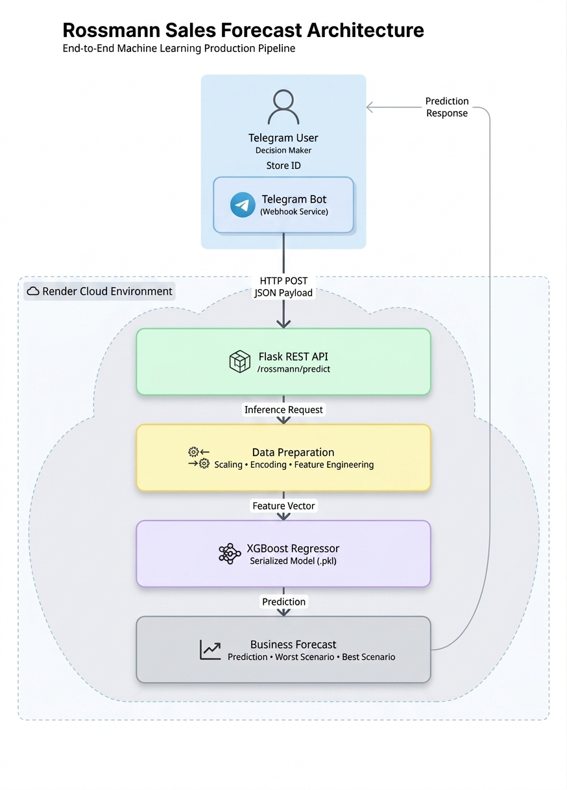
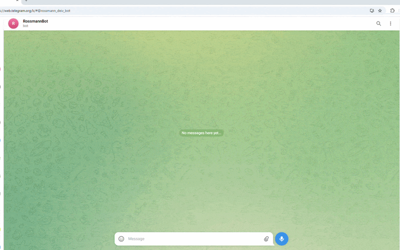
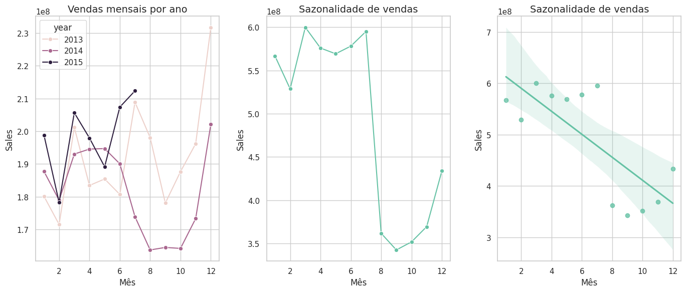
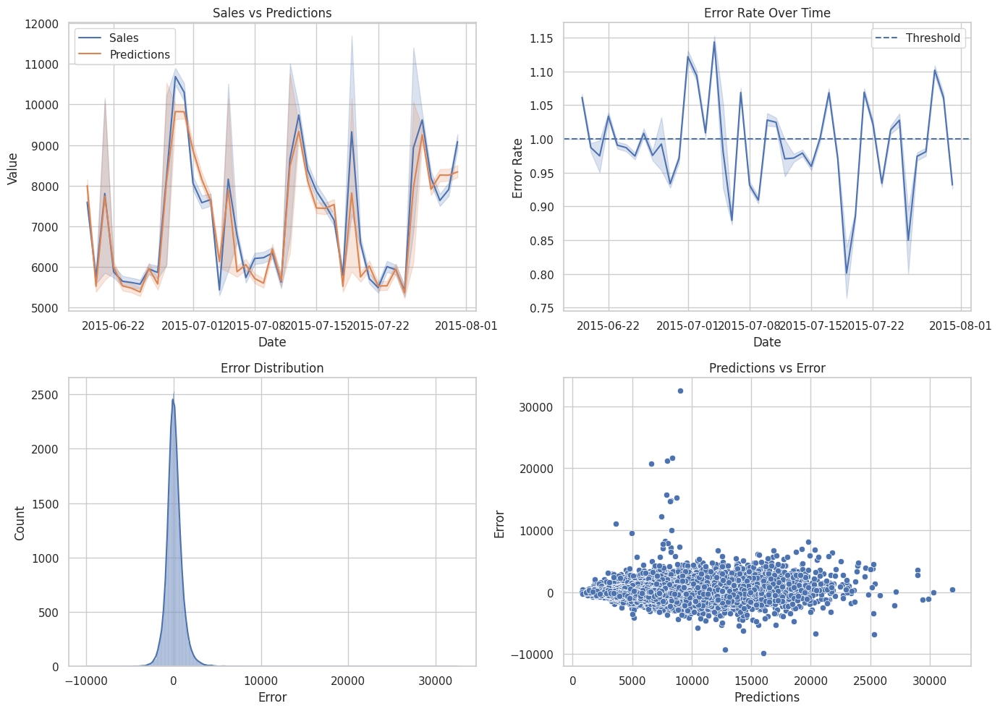

# 📈 Rossmann Sales Forecast

### End-to-End Machine Learning System with Flask API, Cloud Deploy and Telegram Bot Integration

<p align="left">

[Python](https://img.shields.io/badge/Python-3.13-blue)

[Flask](https://img.shields.io/badge/Flask-API-black)

[XGBoost](https://img.shields.io/badge/XGBoost-ML-green)

[Render](https://img.shields.io/badge/Deploy-Render-purple)

[Telegram](https://img.shields.io/badge/Bot-Telegram-blue)

[Status](https://img.shields.io/badge/Status-Production-success)

</p>

---

## 📌 Overview

A Rossmann é uma das maiores redes de drogarias da Europa, operando mais de **4.000 lojas**.

Este projeto implementa uma solução completa de **Machine Learning** e **MLOps** para previsão de vendas de lojas, disponibilizando inferências em tempo real via **API REST** e integração com **Telegram Bot**.

A solução foi construída utilizando:

- pipeline preditivo com XGBoost;
- arquitetura desacoplada baseada em microsserviços;
- deploy cloud na Render;
- serving de modelo via Flask API;
- inferência acessível por chatbot.

---

# 📌 1. Problema de Negócio e Contexto Motivacional

O CEO da Rossmann planeja realizar uma reforma e ampliação estrutural em diversas lojas da rede. Para dimensionar o orçamento de **Capex (Capital Expenditure)**, a diretoria financeira necessita de uma previsão precisa de vendas das lojas para as próximas **6 semanas**.

Historicamente, as previsões eram realizadas manualmente pelos gerentes das lojas, gerando inconsistências devido a:

- sazonalidade;
- promoções;
- feriados;
- dias de fechamento;
- variabilidade regional.

## 🧠 Abordagem de Data Science

Para resolver o problema, foi desenvolvido um ecossistema preditivo onde um pipeline de Machine Learning consome dados históricos e disponibiliza inferências em tempo real através de uma API em nuvem, acessada via Telegram Bot pelos tomadores de decisão.

---

# 🏗️ 2. Arquitetura da Solução e MLOps

A solução foi projetada seguindo boas práticas de:

- Engenharia de Software;
- Machine Learning Engineering;
- MLOps;
- arquitetura desacoplada.

---

## 🏗️ System Architecture

<p align="center">

</p>

---

## 🧠 Production Pipeline Flow

1. O usuário envia o número da loja via Telegram;
2. O bot recebe a mensagem e envia uma requisição HTTP para a API;
3. A API executa o pipeline de preparação dos dados;
4. O modelo XGBoost realiza a inferência;
5. A API retorna os resultados consolidados;
6. O bot renderiza a previsão no dispositivo do usuário.

---

# 📱 3. Demonstração e Fluxo do Bot (Telegram)

Para facilitar o acesso rápido dos executivos, o modelo pode ser acessado diretamente pelo Telegram em tempo real.

O fluxo foi desenvolvido para ser:

- intuitivo;
- simples;
- tolerante a falhas;
- orientado à experiência do usuário.

---

## 🎥 Live Demo

<p align="center">

</p>

---

# 💻 4. Pipeline de Desenvolvimento Científico

O desenvolvimento seguiu a metodologia **CRISP-DM**, contendo as seguintes etapas:

---

## ⚙️ Feature Engineering e Filtragem de Dados

### Derivação de Variáveis

Criação de colunas temporais baseadas em data:

- `year`
- `month`
- `day`
- `week_of_year`
- `year_week`

### Tratamento do Tempo de Competição

Cálculo do tempo em meses desde que concorrentes abriram, permitindo avaliar o impacto no faturamento.

### Filtros de Negócio

Remoção de registros:

- lojas fechadas (`Open = 0`);
- vendas zeradas;
- inconsistências operacionais.

---

## 📊 Análise Exploratória de Dados (EDA)

Durante a validação de hipóteses, foram gerados insights relevantes para o negócio, como por exemplo:

---

### Hipótese 1

### Lojas com competidores próximos vendem menos?

❌ **Falso**

A proximidade dos concorrentes não impactou significativamente o faturamento.

---

### Hipótese 2

### Promoções prolongadas aumentam vendas continuamente?

❌ **Parcialmente falso**

Promoções extensas apresentaram queda gradual de efetividade após o período inicial.

---

A imagem abaixo apresenta gráficos de sazonalidade e comportamento temporal das vendas.

<p align="center">

</p>

---

## 🧪 Preparação dos Dados e Seleção de Variáveis

### Rescaling

Aplicação de:

- `RobustScaler` para atributos com muitos outliers;
- `MinMaxScaler` para variáveis temporais.

### Nature Transformation

Transformações cíclicas utilizando:

- seno;
- cosseno.

Aplicadas em variáveis como:

- `month`;
- `day_of_week`.

### Feature Selection

Utilização do algoritmo embarcado **LightGBM** para seleção das variáveis mais relevantes via Feature Importance.

---

# 🤖 5. Modelagem de Machine Learning e Tuning

Foram avaliados diferentes algoritmos utilizando:

- Cross Validation;
- Time Series Split;
- validação temporal.

---

## 📈 Desempenho dos Modelos

| Rank | Model | MAE | MAPE | RMSE |
| --- | --- | --- | --- | --- |
| 1 | XGBoost Tuned | 652.88 | 9.5% | 949.98 |
| 2 | Random Forest | 679.20 | 9.9% | 1010.12 |
| 3 | XGBoost Default | 851.30 | 12.2% | 1245.50 |
| 4 | Linear Regression | 1867.50 | 28.4% | 2671.00 |
| 5 | Lasso Regression | 1891.20 | 28.9% | 2710.40 |
| 6 | Baseline Model | 1354.80 | 20.6% | 1835.14 |

---

## 🧠 Model Selection Strategy

Embora o Random Forest apresentasse métricas competitivas, o modelo escolhido foi o **XGBoost Regressor** devido:

- menor tempo de inferência;
- menor consumo computacional;
- menor tamanho do artefato serializado;
- melhor adequação para deploy cloud econômico.

O Fine Tuning foi realizado utilizando:

- Random Search;
- validação temporal.

---

# 📈 6. Tradução do Erro e Resultados de Negócio

As métricas estatísticas foram traduzidas em impacto financeiro direto para facilitar a tomada de decisão executiva.

O modelo apresentou:

- **MAPE médio geral de 9.5%**
- alta estabilidade temporal
- boa aderência às séries históricas

---

## 💰 Performance por Loja

| Store ID | Predição | Pior Cenário | Melhor Cenário | MAE | MAPE |
| --- | --- | --- | --- | --- | --- |
| 563 | R$ 184.704,32 | R$ 183.955,10 | R$ 185.453,54 | R$ 749,21 | 18.94% |
| 183 | R$ 180.593,29 | R$ 179.305,43 | R$ 181.881,16 | R$ 1.287,86 | 18.22% |
| 710 | R$ 175.884,43 | R$ 175.093,72 | R$ 176.675,14 | R$ 790,70 | 17.87% |
| ... | ... | ... | ... | ... | ... |
| 575 | R$ 198.612,79 | R$ 197.891,72 | R$ 199.333,86 | R$ 721,07 | 16.35% |

---

## 💰 Performance Financeira Consolidada

| Cenário | Faturamento Previsto |
| --- | --- |
| Cenário Esperado | R$ 285.355.392,00 |
| Pior Cenário | R$ 284.623.406,75 |
| Melhor Cenário | R$ 286.087.356,34 |

---

A figura abaixo apresenta:

- previsão vs valores reais;
- distribuição dos erros;
- estabilidade temporal do modelo;
- análise residual.

<p align="center">

</p>

---

# ⚡ 7. Documentação da API e Endpoints

O backend foi desenvolvido utilizando:

- Flask;
- Gunicorn;
- REST API.

---

## 🔌 API Endpoint

### POST `/rossmann/predict`

Executa previsões para uma ou mais lojas.

---

### Headers

```
Content-Type: application/json
```

---

### Request Payload

```json
[
  {
    "Store": 1,
    "DayOfWeek": 5,
    "Date": "2015-07-31",
    "Open": 1,
    "Promo": 1,
    "StateHoliday": "0",
    "SchoolHoliday": 1
  }
]
```

---

### Response

```json
{
  "store": 1,
  "prediction": 5022.48,
  "worst_scenario": 4544.84,
  "best_scenario": 5500.11
}
```

---

# 🚀 8. Tech Stack

## 📊 Data Science & Machine Learning

- Python
- Pandas
- NumPy
- Scikit-Learn
- XGBoost
- LightGBM
- SciPy

---

## 🌐 Backend & API

- Flask
- Gunicorn
- Requests

---

## ☁️ Cloud & DevOps

- Render
- Git/GitHub
- Telegram API

---

## 📈 Data Visualization

- Matplotlib
- Seaborn

---

# 🚀 9. Próximos Passos

- [ ]  Dockerização
- [ ]  CI/CD
- [ ]  monitoramento
- [ ]  autenticação JWT
- [ ]  dashboard analítico
- [ ]  retraining automatizado

---

# 👨‍💻 Autor

Desenvolvido por **Deivisson Cunha**.

---

## 🌐 Connect with Me

- 🌐 [Portfólio](https://deivissoncunha.github.io/portfolio_projetos/)

- 👔 [LinkedIn](https://www.linkedin.com/in/deivisson-cunha/)

- 📧 E-mail: deivissonlcunha@gmail.com